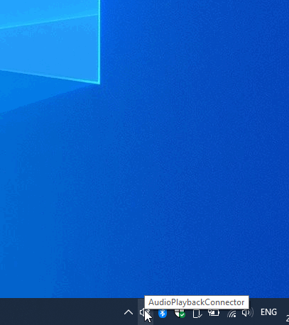

# BTAudio

[English](README.md) | **简体中文**

Windows 10 2004+ 蓝牙音频接收 (A2DP Sink) 连接工具。

本项目是对 [ysc3839](https://github.com/ysc3839) 开发的 [AudioPlaybackConnector](https://github.com/ysc3839/AudioPlaybackConnector) 的一个 fork，原项目已于 2020 年停止维护。本版本在原作基础上进行了优化和增强，以继续提供更好的使用体验。

# 预览

# 使用方法

* 下载并运行 BTAudio。
* 在系统蓝牙设置中添加蓝牙设备。你可以右键点击通知区域的 BTAudio 图标然后选择"蓝牙设置"。
* 点击 BTAudio 图标然后选择想要连接的设备。
* 尽情享受吧！

# 原项目

* [AudioPlaybackConnector](https://github.com/ysc3839/AudioPlaybackConnector) — 由 Richard Yu (ysc3839) 开发的原始项目
